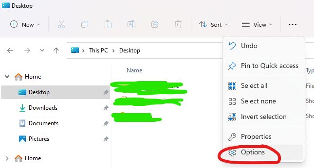
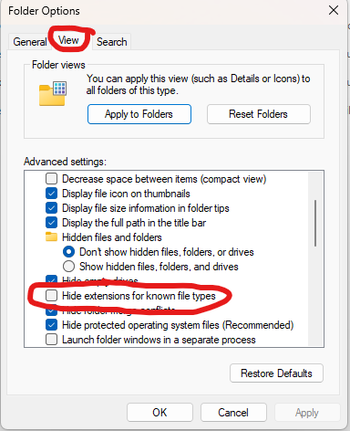

# Navigation
- [Introduction](#intro)
	- [Hmm.. what is Discord Cache folder contains?](#bro_asked)
- [Download Link](#download_link)
- [How to use](#how_use)
	- [Before you run launcher.exe:](#before_run)
	- [To run launcher.exe](#while_run)

# Introduction
- A simple python executable file to convert all Discord cache files into **.png** files extension format

## Hmm.. what is Discord Cache folder contains?
- In my opinion, it contains **most of image type media in your Discord** _(users pfp, emotes, server channel medias, images, memes, etc...)_

# Download Link
- [Click me to download](https://github.com/nicknggt/Discord-Cache-Images-Recovery/releases/download/v1.0/Discord.Images.Recovery.by._NNg_.zip)

# How to use

## Before you run `launcher.exe`:
- **Make sure** your _Discord Cache folder_ located in **C** Drive (specifically in `C:\Users\YOUR_USER_NAME_DOES_NOT_MATTER\AppData\Roaming\Discord\Cache`). Otherwise, the executable file won't work :))
- Make sure to enable Extension file, to enable it, simply do:
	- **Win \+ E** to open Windows Explorer, goto options:
		- 
	- Goto **View** Tab and **untick** the option `Hide extensions for known file types`
		- 

## To run `launcher.exe`:
- Make sure to run it in any of the **C** Drive to avoid **permisson denied** problem and **run it as administrator**
- It will convert all files in the Cache folder into image files and **move** it to a new created folder **Discord_Cache_Images**
